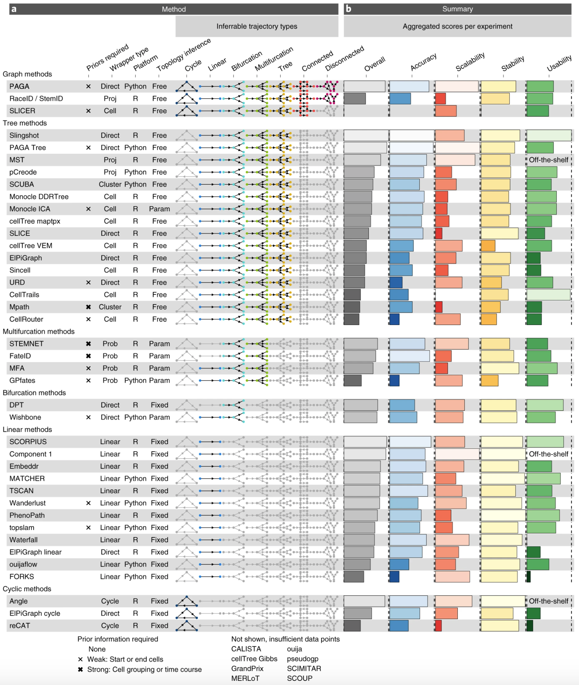

```{r eval = TRUE, echo = FALSE, warning = FALSE, error = FALSE, comment = FALSE, message = FALSE}
require(BiocManager)
require(scran)
require(scuttle)
require(scater)
require(cowplot)
require(igraph)
require(AnnotationDbi)
require(AnnotationHub)
require(mgcv)
require(slingshot)
require(velociraptor)
require(tradeSeq)
require(tidyverse)
```

## 1. Preparing data for trajectory analysis

### Preparing dataset 

We will prepare scRNAseq data corresponding to differentiating sperm cells, 
generated in `Hermann et al., Cell Rep. 2018` (doi: 10.1016/j.celrep.2018.10.026). 

- Inspect the script available in `~/Share/bin/prepare_Hermann.R`. Do you understand each step? How can you exectute this script within R to generate the desired `SingleCellExperiment` object?

<details><summary>Show code</summary><p>
```{r eval = FALSE}
source("~/Share/bin/prepare_Hermann.R")
sce
```
</p></details><br>

- Check the available embeddings of the data.

<details><summary>Show code</summary><p>
```{r eval = FALSE}
reducedDims(sce)
require(patchwork)
p<- scater::plotReducedDim(sce, 'PCA', colour_by = 'label') + ggtitle('PCA') + 
    scater::plotReducedDim(sce, 'DiffusionMap', colour_by = 'label') + ggtitle('DiffusionMap')
```
</p></details><br>

## 2. Trajectory pseudotime inference 

### Trajectory inference 

An important question in scRNAseq field of research is: how to identify a cell trajectory 
from high-dimensional expression data and map individual cells onto it? 
A large number of methods have currently emerged, each one with their own specificities, assumptions, and strengths. 
A nice breakdown (from 2019, so already very outdated!) is available from 
`Saelens et al., Nat. Biotech. 2018` (doi: 10.1038/s41587-019-0071-9): 



#### Slingshot 

`Slingshot` is perhaps one of the most widely used algorithms for users who want to focus on `R`-based approaches. 

```{r eval = FALSE}
sce_slingshot <- slingshot::slingshot(
    sce, 
    reducedDim = 'PCA', 
    approx_points = 200, 
    smoother = 'loess', 
    span = 0.4
)
sce_slingshot
```

- Check the inferred trajectory(ies). Do they fit your expectations? 

```{r eval = FALSE}
inferred_trajectory <- slingshot::slingCurves(sce_slingshot)[[1]]
names(inferred_trajectory)
pca_curve <- as.data.frame(inferred_trajectory$s)
p <- tibble(
    x = reducedDim(sce, 'PCA')[,1], 
    y = reducedDim(sce, 'PCA')[,2], 
    cluster = sce$label
) %>% 
    ggplot() + 
    geom_point(aes(x, y, col = cluster)) + 
    geom_path(data = pca_curve, aes(x = PC1, y = PC2)) + 
    theme_minimal() + 
    coord_fixed()
```

Try adding cluster information to `slingshot`. What do you observe? Discuss. 

<details><summary>Show code</summary><p>
```{r eval = FALSE}
sce_slingshot <- slingshot::slingshot(
    sce, 
    reducedDim = 'PCA', 
    clusterLabels = sce$label, 
    approx_points = 200, 
    smoother = 'loess', 
    span = 0.4
)
pca_curve <- as.data.frame(slingshot::slingCurves(sce_slingshot)[[1]]$s)
p <- tibble(
    x = reducedDim(sce, 'PCA')[,1], 
    y = reducedDim(sce, 'PCA')[,2], 
    cluster = sce$label
) %>% 
    ggplot() + 
    geom_point(aes(x, y, col = cluster)) + 
    geom_path(data = pca_curve, aes(x = PC1, y = PC2)) + 
    theme_minimal() + 
    coord_fixed()
```
</p></details><br>

#### Dynverse 

More TI algorithms can now be explored within `R`, even those relying on `Python` scripts, 
thanks to the `dynverse` package. 

The `dynverse` facilitates trajectory inference with 50+ different algorithms, using a unified syntax. 
Here are the main steps of the recommended workflow: 

```{r eval = FALSE}
library(dyno)
library(tidyverse)

## --- Initiate a `dyno` object
dataset <- wrap_expression(
  counts = t(assay(sce, 'spliced')), 
  expression = t(assay(sce, 'logcounts'))
)

## --- Add clustering info 
dataset <- add_grouping(
    dataset,
    tibble(
        cell_id = colnames(sce), 
        group_id = sce$label
    )
)

## --- Add reduced dimension embedding
dataset <- add_dimred(
    dataset,
    reducedDim(sce, 'PCA')
)

## --- TI
modelFUN <- ti_paga()
model <- infer_trajectory(
    dataset, 
    modelFUN
)
```

To provide such unified framework, `dynverse` needs `Docker` or `Singularity` to be installed and set up. 
It is rather challenging to have these tools properly working on a AWS machine for non-sudo users, so we will let you further explore
this package on your own on a local machine running `Docker`/`Singularity`, should you want it.  

More info are available from [the `dynverse` official website](https://dynverse.org/users/). 

### Pseudotime inference and expression modelling

The pseudotime is simply a number describing the relative position of a cell in the trajectory, 
where cells with larger values are consider to be “after” their counterparts with smaller values.
In trajectories describing time-dependent processes like differentiation, a cell’s pseudotime value 
is generally used as a proxy for its relative age. 

#### Pseudotime inference

- Extract the pseudotime values automatically computed by `slingshot`. Check the distribution of pseudotime values across the different cell clusters. What do you observe? Where you expecting this? 

<details><summary>Show code</summary><p>
```{r eval = FALSE}
sce$pseudotime <- slingshot::slingPseudotime(sce_slingshot)[, 'Lineage1']
p <- tibble(
    cluster = sce$label, 
    pseudotime = sce$pseudotime
) %>% 
    ggplot(aes(x = cluster, y = pseudotime, fill = cluster)) + 
    geom_violin(scale = 'width') + 
    geom_boxplot(outlier.shape = NULL, width = 0.1, fill = 'white') + 
    theme(axis.text.x = element_text(angle = 45, hjust = 1, vjust = 1))
```
</p></details><br>

- Correct pseudotime values as you would expect it to be. 

<details><summary>Show code</summary><p>
```{r eval = FALSE}
sce$pseudotime <- scales::rescale((-1 * slingshot::slingPseudotime(sce_slingshot)[, 'Lineage1']), c(0, 1))
```
</p></details><br>

#### Bonus: daunting snippet but that makes a cool figure for a paper: modeling pseudotime-dependent gene expression

Using pseudotime / cell, one can model gene expression along the differentiation process. 
This alleviates the need to study gene expression **per cell**, and allows one to focus 
on process-related effects (e.g. gene expression during a developmental trajectory). 

- Try to do so for few markers of spermatogonia, spermatocytes and spermatids.

<details><summary>Show code</summary><p>
```{r eval = FALSE}
genes <- c(
    'Id4', 'Sycp3', 'Dmc1', 
    'Acr', 'Prm1', 'Pgk2'
)
fitExprs <- logcounts(sce[genes, ]) %>% # -------------------------------------- Get norm. counts for genes of interest
    as.matrix() %>%
    t() %>%
    as_tibble() %>% 
    mutate(  # ----------------------------------------------------------------- Add information for each cell
        cellID = colnames(sce), 
        cluster = sce$label, 
        pseudotime = sce$pseudotime
    ) %>% 
    pivot_longer(contains(genes), names_to = 'gene', values_to = 'obs_expr') %>% # - Pivot in "long" tidy format 
    mutate(gene = factor(gene, genes)) %>%
    group_by(gene) %>% # ------------------------------------------------------- Group rows by genes
    nest(.key = 'data') %>% # -------------------------------------------------- For each gene, extract the subtable into a column named data
    mutate(
        lmModel = map(data, ~stats::lm(obs_expr ~ pseudotime, data = .)), 
        lmFitted_expr = map(lmModel, predict), # ------------------------------- For each gene, fit the expression values ~ pseudotime with a linear model
        loessModel = map(data, ~stats::loess(obs_expr ~ pseudotime, data = .)), 
        loessFitted_expr = map(loessModel, predict), # ------------------------- For each gene, fit the expression values ~ pseudotime with a loess
        gamModel = map(data, ~mgcv::gam(obs_expr ~ s(pseudotime, bs = "cs"), data = .)), 
        gamFitted_expr = map(gamModel, predict) # ------------------------------ For each gene, fit the expression values ~ pseudotime with a GAM
    ) %>% 
    dplyr::select(-ends_with('Model')) %>%
    unnest(c(data, ends_with('_expr'))) # -------------------------------------- Unnest all the modelled expressions
p <- ggplot(fitExprs) + 
    geom_point(aes(x = pseudotime, y = obs_expr, col = cluster), alpha = 0.5) + 
    geom_line(aes(x = pseudotime, y = gamFitted_expr), col = 'white', size = 2, alpha = 0.5) + 
    geom_line(aes(x = pseudotime, y = gamFitted_expr), col = '#af2d0c', size = 1) +
    theme_minimal() + 
    facet_wrap(~gene) + 
    labs(y = 'logcounts') + 
    ggtitle('Fitted models of pseudotime-dependent gene expression')
```
</p></details><br>

### Ordering trajectory with RNA velocity

As we saw earlier, TI does not necessarily know which direction is right for a given trajectory. 
This can be safely estimated using RNA velocity. For a given gene, a high ratio of unspliced 
to spliced transcripts indicates that that gene is being actively upregulated. Conversely, a low ratio indicates that 
the gene is being downregulated as the rate of production and processing of pre-mRNAs cannot compensate for the degradation of mature transcripts. 
Thus, we can infer that cells with high and low ratios are moving towards a high- and low-expression state, respectively, 
allowing us to assign directionality to any trajectory or even individual cells.

- Check the availables `assays` in the dataset from `Hermann et al.`. Try and run velocity using `velociraptor`. What do you see? Does this help inferring direction of the trajectory? 

<details><summary>Show code</summary><p>
```{r eval = FALSE}
assays(sce)
velo_out <- velociraptor::scvelo(
    sce, 
    assay.X = "spliced", 
    subset.row = rowData(sce)$isHVG, 
    use.dimred = "PCA", 
    mode = 'dynamic'
)
embedded_velo <- velociraptor::embedVelocity(reducedDim(sce, "PCA"), velo_out)
grid.df <- velociraptor::gridVectors(reducedDim(sce, "PCA"), embedded_velo, resolution = 30)
p <- scater::plotReducedDim(sce, 'PCA', colour_by = "label", point_alpha = 0.5) +
    geom_segment(
        data = grid.df, 
        mapping = aes(x = start.PC1, y = start.PC2, xend = end.PC1, yend = end.PC2), 
        arrow = arrow(length = unit(0.05, "inches"), type = "closed")
    )
```
</p></details><br>

## Bonus: Differential expression along differentiation trajectory

### Model gene expression 

Gene expression can be modelled as a function of pseudotime using GAM. 
This can be done manually using the `mgcv` package for instance (see hereabove), but for scRNAseq, 
it can be done more easily with dedicated tools. 

- Using `tradeSeq` utilities, fit a GAM to the scRNAseq counts based on 
the `slingshot` pseudotime value for each cell. 

<details><summary>Show code</summary><p>
```{r eval = FALSE}
sce_fit <- tradeSeq::fitGAM(
    assay(sce, 'spliced'),
    pseudotime = sce$pseudotime,
    cellWeights = matrix(rep(1, ncol(sce))),
    genes = which(rowData(sce)$isHVG),
    nknots = 8,
    verbose = TRUE,
    parallel = FALSE
)
```
</p></details><br>

### Check differentially expressed genes

Several tests to check for DE have been integrated into `tradeSeq`. 

- Try some out. Which one(s) can you use to identify genes getting activated early on during differentiation? And later on? 

<details><summary>Show code</summary><p>
```{r eval = FALSE}
sce_test <- tradeSeq::associationTest(
    sce_fit,
    l2fc = 1
)
res <- sce_test %>% drop_na() %>% arrange(desc(meanLogFC)) %>% head(16)
p <- scater::plotReducedDim(
    sce, 
    'DiffusionMap',
    colour_by = rownames(res)[1], 
    point_alpha = 0.3
)
```

## Acknowledgements 

This exercise was adapted from Chapt. 18 of [Orchestrating Single-Cell Analysis with Bioconductor](https://bioconductor.org/books/release/OSCA/). 

## Session info 

```{r echo = FALSE}
devtools::session_info()
```
