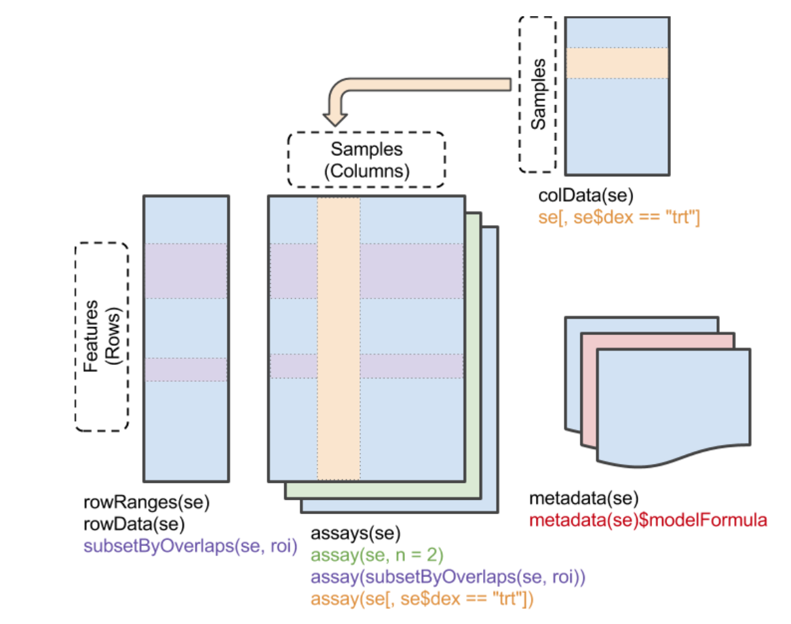

```{r eval = TRUE, echo = FALSE, warning = FALSE, error = FALSE, comment = FALSE, message = FALSE}
require(tidyverse)
require(BiocManager)
require(Seurat)
require(scran)
require(scater)
require(airway)
require(uwot)
require(DropletUtils)
require(scRNAseq)
```

## 1. Installing packages in `R` 

"Hey, I've heard so many good things about this piece of software, it's called 'Seurat'? Heard of it? I wanna try it out soooo badly!"

In other words: "how do I install this or that brand new cutting-edge fancy `package`?"

`R` works with `packages`, available from different sources: 

- `CRAN`, the `R` developer team and official package provider: [CRAN](https://cran.r-project.org/) (which can probably win the title of "the worst webpage ever designed in 1982"). 
- `Bioconductor`, another package provider, with a primary focus on genomic-related packages: [Bioconductor](https://www.bioconductor.org/).
-  Other unofficial sources, such as `GitHub`.

> Install `mgcv`, `HCAData` and `revelio` packages

Each of these three packages is available from a different source. 

<details><summary>Show code</summary><p>
```{r eval = FALSE}
install.packages('mgcv')
BiocManager::install('HCAData')
remotes::install_github('danielschw188/revelio')
```
</p></details><br>

> Check package help pages

Package help pages are available at different places, depending on their source. 
That being said, there is a place I like to go to easily find information related to most packages: 

[https://rdrr.io/](https://rdrr.io/)

For instance, check out `Revelio` package help pages. 

- What is this package designed for? 
- What are its main functions? What type of input does it require? 

## 2. Basic `R` and `Bioconductor` classes

While `CRAN` is a repository of general-purpose packages, `Bioconductor` is the greatest source of analytical tools, data and workflows dedicated to genomic projects in `R`. 
[Read more about `Bioconductor`](https://www.bioconductor.org/about/) to fully understand how it builds up on top of `R` general features, especially with the specific classes it introduces.  

The two main concepts behind `Bioconductor`'s success are the **non-redundant** classes of objects it provides and their **inter-operability**. 
[Huber et al., Nat. Methods 2015](https://www.nature.com/articles/nmeth.3252) summarizes it well.  

### Important R concepts: 

> `tibble` tables: 

`tibbles` are built on the fundamental `data.frame` objects. They follow "tidy" concepts, all gathered in a common [`tidyverse`](https://www.tidyverse.org/). 
This set of key concepts help general data investigation and data visualization through a set of associated packages such as `ggplot2`. 

```{r eval = FALSE}
library(tidyverse)
dat <- tibble(
    x = 1:5, 
    y = 1, 
    z = x ^ 2 + y, 
    class = c('a', 'a', 'b', 'b', 'c')
)
dat
```

> Reading text files into `tibbles`

`tibbles` can be created from text files (or Excel files) using the `readr` package (part of `tidyverse`)

```{r eval = FALSE}
genes <- read_tsv('~/Share/GSM4486714_AXH009_genes.tsv', col_names = c('ID', 'Symbol'))
genes
```

> Handling of `tibbles`: 

`tibbles` can be readily "sliced" (i.e. selecting rows by number/name), "filtered" (i.e. selecting rows by condition) and columns can be "selected". 
All these operations are performed using verbs (most of them provided by the `dplyr` package, part of `tidyverse`). 

```{r eval = FALSE}
slice(genes, 1:4)
filter(genes, Symbol == 'CCDC67')
filter(genes, grepl('^CCDC.*', Symbol))
filter(genes, grepl('^CCDC.*', Symbol), grepl('.*5$', Symbol))
select(genes, 1)
select(genes, ID)
select(genes, matches('Sym.*'))
```

Columns can also be quickly added/modified using the `mutate` verb. 

```{r eval = FALSE}
mutate(genes, chr = sample(1:22, n(), replace = TRUE))
```

> `%>%` pipe: 

Actions on `tibbles` can be piped as a chain, just like `|` pipes `stdout` as the `stdin` of the next command in `bash`. 
In this case, the first argument is always the output of the previous function and is ommited. 
Because `tidyverse` functions generally return a modified version of the input, pipping works remarkably well in such context. 

```{r eval = FALSE}
read_tsv('~/Share/GSM4486714_AXH009_genes.tsv', col_names = c('ID', 'Symbol')) %>% 
    mutate(chr = sample(1:22, n(), replace = TRUE)) %>% 
    filter(chr == 2, grepl('^CCDC.*', Symbol)) %>% 
    select(ID) %>% 
    slice_head(n = 3)
```

### Important Bioconductor concepts: 

> `SummarizedExperiment` class:

The most fundamental class used to hold the content of large-scale quantitative analyses, such as counts of RNA-seq experiments, or high-throughput cytometry experiments or proteomics experiments. 



Make sure you understand the structure of objects from this class. A dedicated workshop that I would recommend quickly going over is available [here](https://www.bioconductor.org/help/course-materials/2019/BSS2019/04_Practical_CoreApproachesInBioconductor.html).
Generally speaking, a `SummarizedExperiment` object contains matrix-like objects (the `assays`), with rows representing features (e.g. genes, transcripts, ...) and each column representing a sample. 
Information specific to genes and samples are stored in "parallel" data frames, for example to store gene locations, tissue of expression, biotypes (for genes) or batch, generation date, or machine ID (for samples). 
On top of that, metadata are also stored in the object (to store description of a project, ...). 

An important difference with S3 `list`-like objects usually used in `R` is most of the underlying data (organized in `"slots"`) 
is accessed using `getter` functions, rather than the familiar `$` or `[`. Here are some important `getters`: 

    - `assay()`, `assays()`: Extrant matrix-like or list of matrix-like objects of identical dimensions. Since the objects are `matrix`-like, `dim()`, `dimnames()`, and 2-dimensional `[`, `[<-` methods are available. 
    - colData(): Annotations on each column (as a DataFrame): usually, description of each sample
    - rowData(): Annotations on each row (as a DataFrame): usually, description of each gene
    - metadata(): List of unstructured metadata describing the overall content of the object.

Let's dig into an example (you may need to install the `airway` package from `Bioconductor`...)

```{r eval = FALSE}
library(SummarizedExperiment)
library(airway)
data(airway)
airway
```

- What are the dimensions of the dataset? What type of quantitative data is stored? Which features are assessed? 

<details><summary>Show code</summary><p>
```{r eval = FALSE}
dim(airway)
rowData(airway)
colData(airway)
```
</p></details><br>

- Can you create a subset of the data corresponding to `LRG` genes in untreated samples? 

<details><summary>Show code</summary><p>
```{r eval = FALSE}
untreated_LRG <- airway[grepl('^LRG_', rownames(airway)), airway$dex == 'untrt']
untreated_LRG
```
</p></details><br>

> `GenomicRanges` class (a.k.a. `GRanges`): 

`GenomicRanges` are a type of `IntervalRanges`, they are useful to describe genomic intervals. 
Each entry in a `GRanges` object has a `seqnames()`, a `start()` and an `end()` coordinates, a `strand()`, as well as associated metadata (`mcols()`). 
They can be built from scratch using `tibbles` converted with `makeGRangesFromDataFrame()`. 

```{r eval = FALSE}
library(GenomicRanges)
gr <- read_tsv('~/Share/GSM4486714_AXH009_genes.tsv', col_names = c('ID', 'Symbol')) %>% 
    mutate(
        chr = sample(1:22, n(), replace = TRUE), 
        start = sample(1:1000, n(), replace = TRUE),
        end = sample(10000:20000, n(), replace = TRUE),
        strand = sample(c('-', '+'), n(), replace = TRUE)
    ) %>% 
    makeGRangesFromDataFrame(keep.extra.columns = TRUE)
gr
mcols(gr)
```

Just like `tidyverse` in R, `tidy` functions are provided for `GRanges` by the `plyranges` package. 

```{r eval = FALSE}
library(plyranges)
gr %>% 
    filter(start < 400, end > 12000, end < 15000) %>% 
    seqnames() %>% 
    table()
```

- Can you find a way to easily read common input files such as `bed` or `gff` files into `GRanges`? 

<details><summary>Show code</summary><p>
```{r eval = FALSE}
library(rtracklayer)
genes2 <- import('~/Share/GRCm39_genes.bed')
genes2
genes3 <- import('~/Share/GRCm39_genes.gff3')
genes3
```
</p></details><br>

- How would you have proceeded without `rtracklayer`? Check the `start` coordinates: what do you see? Comment on the interest of using `Bioconductor`. 

<details><summary>Show code</summary><p>
```{r eval = FALSE}
library(rtracklayer)
genes2_manual <- read_tsv('~/Share/GRCm39_genes.bed', col_names = FALSE) %>% 
    drop_na() %>%
    purrr::set_names(c('chr', 'start', 'stop', 'id', 'score', 'strand')) %>% 
    makeGRangesFromDataFrame(keep.extra.columns = TRUE)
genes2_manual
head(start(genes2))
head(start(genes2_manual))
genes3_manual <- read_tsv('~/Share/GRCm39_genes.gff3', col_names = FALSE, comment = '#') %>% 
    drop_na() %>%
    purrr::set_names(c('chr', 'source', 'type', 'start', 'stop', 'score', 'strand', 'empty', 'info')) %>% 
    makeGRangesFromDataFrame(keep.extra.columns = TRUE)
genes3_manual
head(start(genes2))
head(start(genes2_manual))

```
</p></details><br>

## 3. CRAN & Bioconductor approaches to scRNAseq

### scRNAseq in Bioconductor

For single-cell RNA-seq projects, `Bioconductor` has been introducting new classes and standards very rapidly in the past few years. 
Notably, several packages are increasingly becoming central for single-cell analysis: 

- **SingleCellExperiment**
- scater
- scran
- scuttle
- batchelor
- SingleR
- bluster
- DropletUtils
- slingshot
- tradeSeq
- ... 

**SingleCellExperiment** is the fundamental class designed to contain single-cell (RNA-seq) data in `Bioconductor` ecosystem. It is a modified version of the 
`SummarizedExperiment` object, so most of the getters/setters are shared with this class. 


```{r eval = FALSE}
source('~/Share/bin/prepare_Nestorowa.R') # Adapted from Nestorowa et al., Blood 2016 (doi: 10.1182/blood-2016-05-716480)
sce
class(sce)
```

Several slots can be accessed in a **SingleCellExperiment** object, just like the `SummarizedExperiment` object it's been adapted from: 

```{r eval = FALSE}
colData(sce)
rowData(sce)
metadata(sce)
dim(sce)
assays(sce)
```

Important slots for scRNAseq studies can also be accessed:

```{r eval = FALSE}
counts(sce)[1:10, 1:10]
logcounts(sce)[1:10, 1:10]
reducedDims(sce)
head(reducedDim(sce, 'diffusion'))
```

- Check the `colData()` output of the `sce` object. What information is stored there? How can you access the different objects stored in `colData`? 

<details><summary>Show code</summary><p>
```{r eval = FALSE}
colData(sce)
lapply(colData(sce), class)
head(colData(sce)[[1]])
head(colData(sce)[['FACS']])
head(sce$sizeFactor)
```
</p></details><br>

- Are there any reduced dimensionality representation of the data stored in the `sce` object? How can we run a `PCA` using normalized counts?

<details><summary>Show code</summary><p>
```{r eval = FALSE}
reducedDims(sce)
pca <- prcomp(t(logcounts(sce)))
names(pca)
dim(pca$x)
head(pca$x[, 1:50])
reducedDim(sce, "pca") <- pca$x
```
</p></details><br>

- Now, let's compute a `UMAP` embedding from this `PCA` and compare it to the `diffusion` embedding. 

<details><summary>Show code</summary><p>
```{r eval = FALSE}
umap <- uwot::umap(reducedDim(sce, "pca"))
colnames(umap) <- c('UMAP1', 'UMAP2')
reducedDim(sce, "umap") <- umap
library(patchwork)
p1 <- scater::plotReducedDim(sce, 'pca', colour_by = 'label', text_by = 'label') + ggtitle('PCA')
p2 <- scater::plotReducedDim(sce, 'umap', colour_by = 'label', text_by = 'label') + ggtitle('UMAP')
p3 <- scater::plotReducedDim(sce, 'diffusion', colour_by = 'label', text_by = 'label') + ggtitle('Diffusion')
p <- p1 + p2 + p3
p
```
</p></details><br>

### scRNAseq in R

[`Seurat`](https://satijalab.org/seurat/articles/get_started.html) is another very popular ecosystem to investigate scRNAseq data. 
It is primarily developed and maintained by [the Sajita Lab](https://satijalab.org/seurat). 
It originally begun as a single package aiming at encompassing "all" (most) aspects of scRNAseq analysis. 
However, it rapidly evolved in a much larger project, and now operates along with other ["wrappers" and extensions](https://satijalab.org/seurat/articles/extensions.html). 
It also has a [very extended support](https://github.com/satijalab/seurat/discussions) from the lab group. 
All in all, is provides a (somewhat) simple workflow to start investigating scRNAseq data. 

It is important to chose one standard that you feel comfortable with yourself. Which standard provides the most 
intuitive approach for you? Do you prefer a unique, "plug-n-play" workflow (`Seurat`-style), or a modular approach (`Bioconductor`-style)? 
Which documentation is easier to read for you, a central full-featured website with extensive examples (`Seurat`-style), 
or "programmatic"-style vignettes (`Bioconductor`-style)? 

This course will sometimes use `Seurat`-based methods, and sometimes `Bioconductor`-based methods. 
In the absence of coordination of data structures, the next best solution is to write functions to 
coerce an object from a certain class to another class (i.e. `Seurat` to `SingleCellExperiment`, or vice-versa).
Luckily, this is quite straightforward in `R` for these 2 data classes: 

```{r eval = FALSE}
sce_seurat <- Seurat::as.Seurat(sce)
str(sce)
sce
sce_seurat
sce2 <- Seurat::as.SingleCellExperiment(sce_seurat)
```

- Do you see any change between `sce` and the corresponding, "back-converted", `sce2` objects? Explain these differences.

<details><summary>Show code</summary><p>
```{r eval = FALSE}
sce
sce2
#
colData(sce)
colData(sce2)
```
</p></details><br>

- Try and access the underlying raw or normalized data from the `sce_seurat` object. How does it compare to data access from an `SingleCellExperiment` object? 

<details><summary>Show code</summary><p>
```{r eval = FALSE}
colnames(sce_seurat)
ncol(sce_seurat)
nrow(sce_seurat)
# cells and features access
head(Seurat::Cells(sce_seurat))
head(rownames(sce_seurat))
# cell data access
head(sce_seurat[[]])
head(sce_seurat$label)
# Counts access
Seurat::GetAssayData(object = sce_seurat, slot = "counts")[1:10, 1:10]
Seurat::GetAssayData(object = sce_seurat, slot = "data")[1:10, 1:10]
# Embeddings 
head(Seurat::Embeddings(object = sce_seurat, reduction = "pca"))
head(Seurat::Embeddings(object = sce_seurat, 'umap')[1:10,])
```
</p></details><br>

## 4. Reading scRNAseq data 

- Try to load the raw `10X` single-cell RNA-seq data downloaded yesterday (from `Lier et al.`) into a **SingleCellExperiment** object using `DropletUtils` package. 

<details><summary>Show code</summary><p>
```{r eval = FALSE}
library(SingleCellExperiment)
sce <- DropletUtils::read10xCounts('~/Share/GSM4486714_AXH009_', type = 'prefix')
sce
colData(sce)
rowData(sce)
```
</p></details><br>

Public single-cell RNA-seq data can be retrieved from within R directly, thanks to several data packages, for instance `scRNAseq` or `HCAData`. 

- Check out the `He et al., Genome Biol. 2020` paper. Can you find a way to load the scRNAseq data from this paper without having to leave the `R` console? 

<details><summary>Show code</summary><p>
```{r eval = FALSE}
organs <- scRNAseq::HeOrganAtlasData(ensembl = TRUE)
organs
```
</p></details><br>

- The interest of this approach is that one can recover a full-fledged **SingleCellExperiment** (often) provided by the authors of the corresponding study. 
This means that lots of information, such as batch ID, clustering, cell annotation, etc., may be readily available. Check the data available for cells/features in the dataset from `He et al.`. 

<details><summary>Show code</summary><p>
```{r eval = FALSE}
colData(organs)
table(organs$Tissue)
table(organs$reclustered.fine, organs$Tissue)
```
</p></details><br>

- Does the **SingleCellExperiment** object corresponding to `He et al., Genome Biol. 2020` data (obtained through `scRNAseq` package) contain normalized data? 
What about cell projections on embedded spaces? Try and add them. 

<details><summary>Show code</summary><p>
```{r eval = FALSE}
library(scater)
library(patchwork)
p1 <- plotReducedDim(organs, 'tSNE', colour_by = 'Tissue', by_exprs_values = 'counts', text_by = 'Tissue') + ggtitle('Tissues')
p2 <- plotReducedDim(organs, 'tSNE', colour_by = 'ENSG00000118137', by_exprs_values = 'counts', text_by = 'Tissue') + ggtitle('APOA1')
p <- p1 + p2
p
```
</p></details><br>

## 5. Bonus 

To compare the two different approaches, try preparing both a 
`SingleCellExperiment` or a `Seurat` object from scratch, using the matrix files 
generated in the previous lab. Read the documentation of the two related packages to 
understand how to do this.  
This will be extensively covered in the next lab for everybody. 

## Session info 

```{r echo = FALSE}
devtools::session_info()
```
